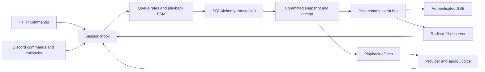

# Architecture

Parent: [Documentation index](README.md)

NaHörMaar has one listening session. A listener searches through the catalog,
adds a track to the queue, and the engine sends audio to Discord. The dashboard
reads the resulting state through HTTP and live events. This page explains the
boundaries behind that path; the exact endpoint shapes live in the
[engine API](engine-api.md).

## Contents

- [Architecture](#architecture)
  - [Contents](#contents)
  - [Command and event flow](#command-and-event-flow)
  - [Frontend ownership](#frontend-ownership)
  - [Backend ownership](#backend-ownership)
  - [Catalog, metadata and radio](#catalog-metadata-and-radio)
  - [Audio and recovery](#audio-and-recovery)
  - [Storage and access](#storage-and-access)

## Command and event flow

A search or playlist link goes to the catalog. Its provider returns findings
that the dashboard can display and select without changing playback. Once a
listener adds a selection, the request enters the Session inbox. That is where
queue order, attribution and playback state are decided. The Session commits a
new state before telling other listeners about it or starting an audio effect.

A command checks its revision or attempt precondition inside the inbox. Queue,
checkpoint, history, receipt and revision updates commit before state is exposed.
A failed transaction cannot publish success. A repeated operation ID from the
same actor and command returns its durable result with current state; conflicting
reuse fails. Accepted work survives cancellation of its HTTP caller.

The playback FSM chooses the next state and declares effects; it does not reach
into the database or start background work. The playback controller runs those
effects after commit. Resolver, voice and audio results carry attempt,
connection or preparation IDs, so late results cannot modify their successors.
History begins only after confirmed media output, once per logical play. Pause,
seek, retry and restart retain that play identity.

The in-memory event bus is separate from the transaction and from SSE transport.
Normal subscribers have bounded FIFOs; overflow detaches a slow consumer.
Radio listens for committed changes and refills against the current queue. SSE
starts with a complete snapshot, checks access during idle periods and before
delivery, and resynchronizes on reconnect. It is not a durable activity log.

## Frontend ownership

Paths in this section are relative to `frontend/`.

`frontend/shared/api.generated.ts` is generated offline from the public API
models, including the account and appearance contract. `shared/engine.ts` names
wire types and projects track references into display data.

`app/repositories/` owns typed endpoint calls. Session handles queue, playback,
connection, radio and decoded SSE events; Catalog handles search, links and pinned
discovery snapshots; Account handles sessions, profile and appearance. A shared
HTTP transport supplies timeouts, cancellation, JSON/empty responses, errors and
CSRF. The Nuxt plugin provides one set per app through Vue injection. Auth hooks
read the profile store at request time; repositories never import stores or UI.
Responses from an earlier account generation are discarded.

`stores/player.ts` owns one session snapshot, the playback clock anchor, pending
operations and the SSE subscription lifetime. Its display snapshot is computed.
The default layout starts and disposes this lifetime with the signed-in account.
HTTP and SSE pass through the same revision checks and operation deduplication.
`usePlayerNotifications` translates the resulting activity into toasts using
semantic actions and request IDs; retry preserves the original payload and key.
Playback controls target an attempt, while video rendering keeps the logical
play ID across seeks and reconnects.

`useDiscovery` owns search/import/selection workflow; the Vue panel owns focus and
scroll. `useCatalog` owns local results, pagination, refresh polling and cancellation;
displayed versions stay pinned until the listener accepts an update. Closing the
panel cancels pending work. Queue duplicate checks use persistent track IDs;
playlist positions identify separate occurrences. `stores/radioPreview.ts` shares
only the proposed radio seed between entry points and reuses known references;
the active radio belongs to the player session.
Track presentation components accept metadata without manufacturing queue entries.

`stores/profile.ts` owns identity, session expiry and cross-tab refresh.
`stores/settings.ts` owns appearance, debounce and retry. A refresh cannot overwrite
unsaved local appearance changes. Account changes invalidate pending requests,
clear private view state and bind the new account's settings.

## Backend ownership

The following paths are relative to `backend/src/nahormaar_backend/`.

| Module                                                              | Responsibility                                                                                    |
| ------------------------------------------------------------------- | ------------------------------------------------------------------------------------------------- |
| `engine/bootstrap.py`                                               | Production composition: configuration, schema, Discord readiness, commands, presence and lifetime |
| `engine/runtime.py`                                                 | Own injected resources and compose metadata, catalog and Session                                  |
| `engine/session.py`                                                 | Serialize mutations, own committed state and transactions, deliver post-commit events             |
| `engine/domain/queue.py`                                            | Pure queue editing, revision conflicts, attribution and Undo handling                              |
| `engine/domain/playback.py`                                         | Pure FSM decisions: next state and typed effects                                                  |
| `engine/playback.py`                                                | Execute effects, manage resolver/preload tasks and report correlated results                      |
| `engine/domain/radio.py`                                            | Manual and radio queue-filling strategies                                                         |
| `engine/catalog.py`                                                 | Select providers and coordinate discovery, audio resolution and cache snapshots                   |
| `engine/providers.py`, `engine/youtube.py`                          | Provider protocol and YouTube/Music translation                                                   |
| `engine/metadata.py`                                                | Merge observations into persistent track and artist identities                                    |
| `engine/persistence.py`                                             | Async SQLAlchemy repositories and explicit transaction boundaries                                 |
| `engine/discord.py`                                                 | Voice and audio adapter; reuse FFmpeg, buffering, mixing and Opus mechanisms                      |
| `engine/gateway.py`, `engine/commands.py`                           | Discord events, presence and whitelist-protected `/pspsps`                                        |
| `engine/api.py`, `engine/http_auth.py`                              | Native HTTP/SSE and account authorization                                                         |
| `application/auth.py`, `application/access.py`                      | OAuth login, session lifecycle and live whitelist                                                 |
| `domain/identity.py`, `domain/accounts.py`, `domain/preferences.py` | Shared account and contributor values                                                             |
| `persistence/accounts.py`, `persistence/models.py`                  | Account/login storage using short independent transactions                                        |
| `integrations/`                                                     | Reused audio processing, process ownership, provider subprocesses, OAuth and daily bio            |

The event loop is supplied by the application runtime. A Session has one
bounded inbox (128 pending messages); it waits for work rather than polling.
It is the only owner that replaces committed playback/queue state. HTTP, Discord
commands and technical callbacks all use this boundary.

`engine/bootstrap.py` constructs the YouTube Music and YouTube providers and the
Discord transport. `engine/runtime.py:open_engine` receives those dependencies,
Auth, the session ID and a clock; it does not read configuration or log a Discord
client in. Provider capabilities are defined in `engine/providers.py`, and the
catalog uses the supplied providers. The composition closes supplied adapters
and providers once, including on partial startup failure.

## Catalog, metadata and radio

Providers translate source-specific results into domain findings and own source
recognition, search, playlists, recommendations and audio resolution. The catalog
chooses the provider; it does not know YouTube response shapes. Temporary audio
URLs and headers stay in memory and are never track metadata.

A provider finding is an observation of a source, not a queue item. The catalog
resolves its source identity to a persistent track ID, and metadata merges new
observations with what is already known about that track. Artist entities need
explicit provider identities; a display name alone does not create one. This
lets later searches refresh a title or cover without rewriting every place the
song has been used.

A queue entry is one request for that track. It carries its own ID, position,
origin and contributor snapshot. Two requests for the same track remain two
entries that can be moved or removed independently. A playback record is
different again: it records a confirmed play, not every time someone queued a
song or the bot tried to resolve one. Playback records also reference the track
instead of copying its metadata. Contributor snapshots keep the name attached
to a request or play even if the profile changes later.

Searches, playlists and track observations use bounded caches with shared refresh
work. Search and track observations are fresh for five minutes, playlist
observations for one minute. Stale data can appear immediately while one shared
refresh runs; a failed refresh keeps the last known result. Versioned discovery
snapshots keep selections stable while fresh results arrive. Queue additions use
track IDs from the displayed version, not positions in a possibly refreshed list.

Manual mode adds nothing automatically. Radio mode fills the queue towards three
upcoming entries using the seed provider's recommendations. Manual entries count
towards that target; current/recent/queued or excluded tracks are filtered.
Generation and request IDs reject stale results after stop or seed changes.
Provider work runs outside the inbox; results re-enter it for a single queue
commit. Pausing suspends refill. An unexpected voice disconnect suspends playback
and retains radio mode; an explicit Leave, Stop or full queue clear ends it.
The active strategy is stored in the Session transaction with queue changes.
After a process restart, Radio keeps its source, initiator and unused candidates.
An interrupted provider request is retried; queued and recently played tracks
are excluded from the refill.

## Audio and recovery

`DiscordOutput` implements the audio and voice protocols. The reused
`integrations/audio_sources.py` and `audio_mixer.py` own decoding, bounded buffers,
mixing and Opus output. Compatible Opus packets pass through unchanged at unity
volume outside overlaps. Volume changes and crossfade use the mixer; only consumed
audio frames advance position and fade time.

Preparation belongs to the current attempt and next queue occurrence. Seek,
reorder, stop or disconnect can invalidate it. At most two source buffers are
owned during a transition. Cancellation settles subprocesses and buffers before
their ownership is released.

Checkpoints record measured position, playing/paused intent and the chosen
channel. They refresh every five seconds and on clean shutdown. Startup restores
the same listening-session identity, rejoins its saved channel and resumes the
retained track. A confirmed current play remains in the history without counting
again after a restart. Explicit pause stays paused. Explicit Leave clears
automatic rejoin intent; an unexpected disconnect suspends without an immediate
rejoin loop. Joining again resumes through the same FSM, including `/pspsps`.

Shutdown closes SSE before HTTP drain, settles Session work, freezes output and
saves its checkpoint, then closes effects, catalog/provider work, storage, Auth
and the gateway. Partial startup also releases acquired resources. The normal
entry point reserves the API port before Discord login and runs one worker.

## Storage and access

The engine schema has a frozen Alembic chain under `engine/migrations/`.
Startup initializes an empty database and its single listening session atomically.
It reopens an existing engine database and rejects old or foreign schemas without
replacing or importing them. Account tables share the database but not the
Session's playback transactions. Database paths and migrations are described in
the [development guide](development.md#database-changes).

Discord OAuth uses `identify` and PKCE. Login attempts are browser-bound and
single-use. Seven-day session cookies are HTTP-only; only their hashes are stored.
Account sessions survive backend restarts.
Every protected request checks the current whitelist. Mutations also require
the configured origin and session-bound CSRF token. Account IDs and contributor
values come from authentication, never client-supplied attribution.

There is currently one shared queue and one active voice connection across the
bot's servers. Independent server sessions and Spotify matching are separate
work. See the [API contract](engine-api.md),
[development guide](development.md) and [roadmap](../ROADMAP.md).
