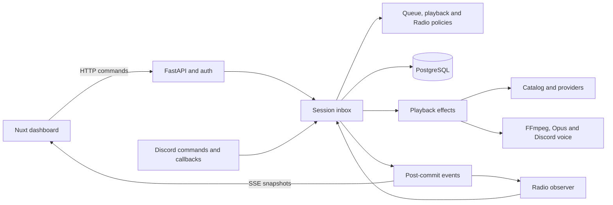
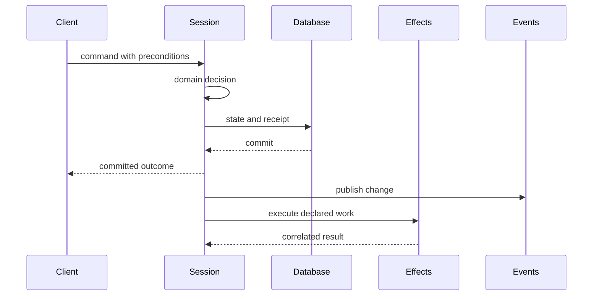

# Architecture

Parent: [Documentation index](README.md)

NaHörMaar has a Nuxt dashboard, one Python engine and a Discord bot. A listener
finds music through the catalog, adds a persistent track to the shared queue and
the engine sends audio to one voice channel. This page connects those parts; the
domain details live under [Engine documentation](engine/) and the HTTP/SSE shapes
live in the [Engine API](engine-api.md).

## Table of contents

- [Architecture](#architecture)
  - [Table of contents](#table-of-contents)
  - [System at a glance](#system-at-a-glance)
  - [Command and event flow](#command-and-event-flow)
  - [Responsibility map](#responsibility-map)
  - [Composition and lifetime](#composition-and-lifetime)
  - [Access boundary](#access-boundary)
  - [Current scope](#current-scope)

## System at a glance

The dashboard never owns shared playback. It presents the committed Session,
sends typed commands and reconciles HTTP replies with live events. The engine
owns queue order, playback intent, Radio and the voice connection. Providers own
source-specific discovery and audio resolution. PostgreSQL owns durable state, not
running tasks or temporary media URLs.

## Command and event flow

A command from HTTP or Discord enters one bounded Session inbox. Inside that
serialized boundary, the domain policy checks revisions and attempt identities,
decides the next state and writes it with the command receipt. The transaction
commits before success is published or a playback effect starts.

Provider, FFmpeg and Discord work runs outside the transaction. Each result
carries the attempt, connection, preparation or Radio generation that requested
it. The Session discards a late result after newer work has replaced that
identity.

The event bus is post-commit and in memory. SSE sends a complete snapshot on
connection, then committed changes. Radio observes the same stream and may send a
new queue command. Neither SSE nor the event bus is a durable audit log.

## Responsibility map

| Concern | Owner | Details |
| --- | --- | --- |
| Search, links and metadata | Catalog | [Catalog](engine/catalog.md) |
| Queue order, attribution and history | Queue and Session | [Queue](engine/queue.md) |
| Automatic queue supply | Radio strategy and observer | [Radio](engine/radio.md) |
| FSM, audio, voice and restart | Playback | [Playback](engine/playback.md) |
| SQLAlchemy, transactions and migrations | Persistence and schema | [Database](engine/database.md) |
| HTTP and live events | API | [Engine API](engine-api.md) |
| Typed client calls and UI state | Nuxt repositories, stores and composables | [Frontend](frontend.md) |
| Installation and access policy | Access service | [Discord setup](discord-setup.md) |

The code-level engine map and a suggested reading order live in the
[engine index](engine/). That index is the entry point for implementation detail;
this page remains the overview.

## Composition and lifetime

`backend/src/nahormaar_backend/engine/bootstrap.py` reads configuration and
composes the production providers, Discord transport, account services and
engine. `engine/runtime.py` owns the injected resources and creates metadata,
catalog and Session services. The domain modules do not read environment values
or log a Discord client in.

The application uses the host event loop. A Session waits on its bounded inbox
instead of polling. One backend worker owns one bot and one player; starting
multiple workers would create competing owners.

Startup and shutdown release resources in ownership order, including after a
partial startup. [Playback](engine/playback.md#shutdown-order) owns the detailed
drain, checkpoint and audio sequence.

## Access boundary

Discord OAuth identifies dashboard users. Accounts carry their access role.
The Access service resolves owner and admin roles from `access.toml`; normal
listener roles and their grant attribution live on the account in PostgreSQL.
Queue attribution comes from the authenticated account, never from a
client-supplied user field. Revocation clears the listener role and removes
active sessions in one transaction.

The [Discord setup guide](discord-setup.md) owns application installation,
redirects and operator configuration. The [Engine API](engine-api.md#authentication)
owns the authentication routes and HTTP requirements.

## Current scope

The runtime supports one listening session, one shared queue and one active voice
connection across all Discord servers where the bot is installed. The
[roadmap](../ROADMAP.md) owns work towards independent server sessions.
